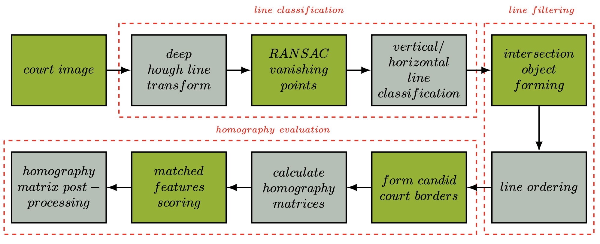
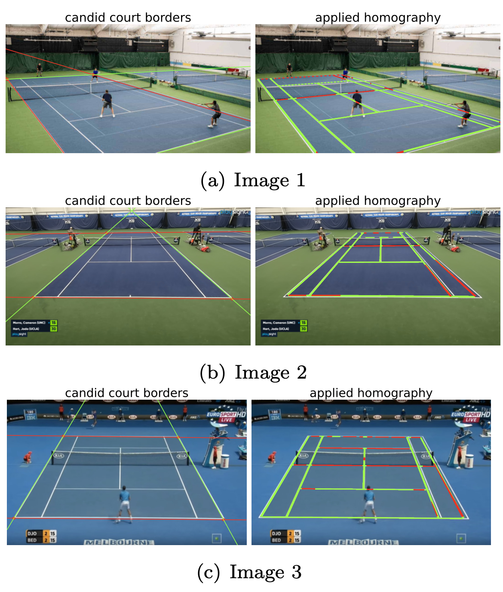

# Court Detection using Deep Hough Transform Line Priors 

This is a course project that implemented the use of the [Deep-Hough-Transform-Line-Priors](https://arxiv.org/abs/2007.09493) to detect tennis court lines and find the homography matrix. Check out the report for more detailed information.

## Description
Filtering the lines post detection is necessary to identify the true bounding box of the court and to calculate the homography matrix. The homography matrix can be utilized to warp the perspective and deployed in various other applications such as score tracking or player movement behaviour during the match.

The process pipeline is as follows:

Three examples of applying and scoring the homography matrix:

